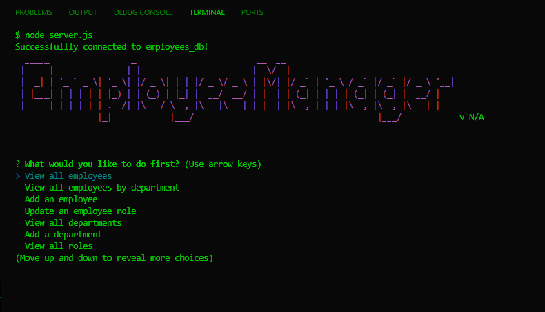
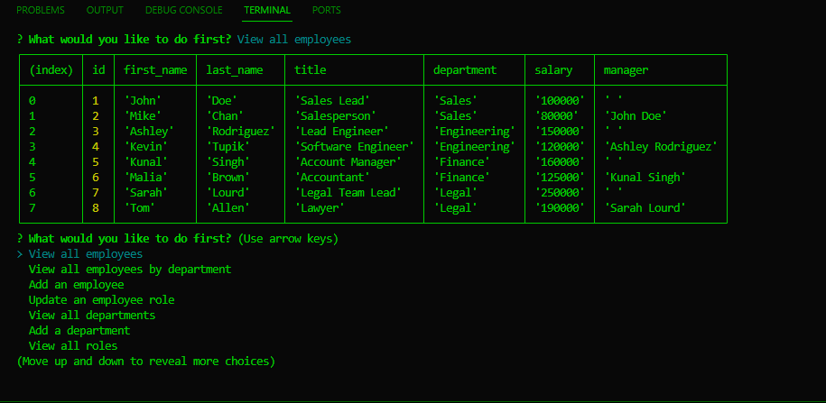
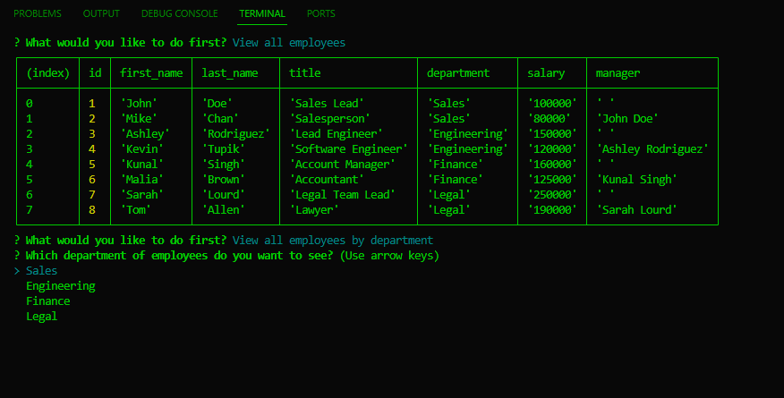
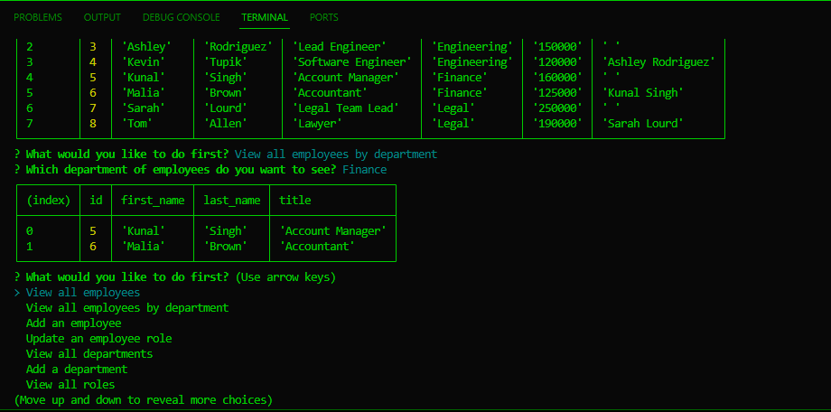
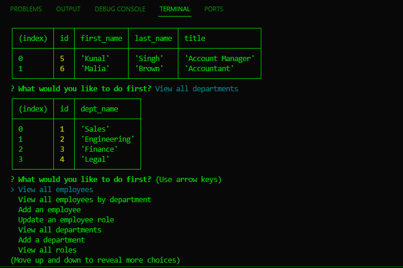
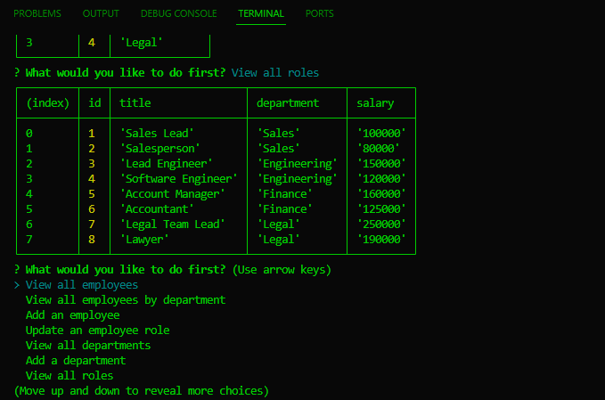

  # Employee Tracker

  ## Description
  This is a CLI app using nodeJS, JS, ExpressJS for functionality, and postgreSQL for the database. The user can view all departments, roles, and employees. The user may also add each of these to the database, as well as update an employee role, and view all employees by department. 

  ## Table of Contents
  [Installation](#installation)

  [Usage](#usage)

  [License](#license)

  [Contributors](#contributors)

  [Tests](#tests)

  [Questions](#questions)

  ## Installation
  npm i
  
  ## Usage
  1. psql -U postgres to log into postgresSQL to set up database;
  2. \i db/schema.sql;
  3. \i db/seeds.sql;
  4. \q;
  5. node index.js
  6. [USAGE VIDEO](https://drive.google.com/file/d/1-DnEeKJapIQrLL3D-r5HLvqaEaV9f0vq/view?usp=drive_link)

  
  ## Screenshots
  
  
  
  
  
  
  
  ### Contributors
  I worked with Alex Gonzalez as a tutor for a better understanding of this project

  ### Questions
  [GIT AT ME!](https://github.com/VicSwain)

  [REACH ME](@huracanmusic2016@gmail.com)

  #### License 
  No license
  
  #### Tests
  N/A